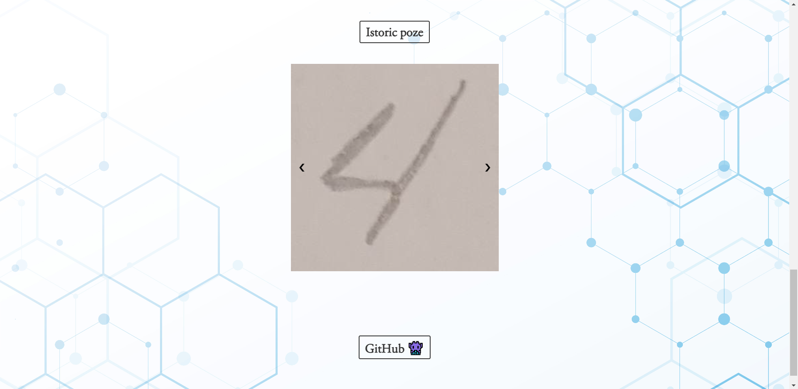
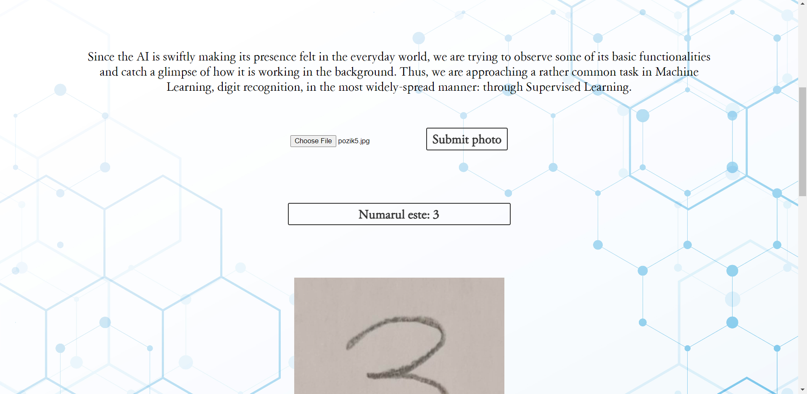
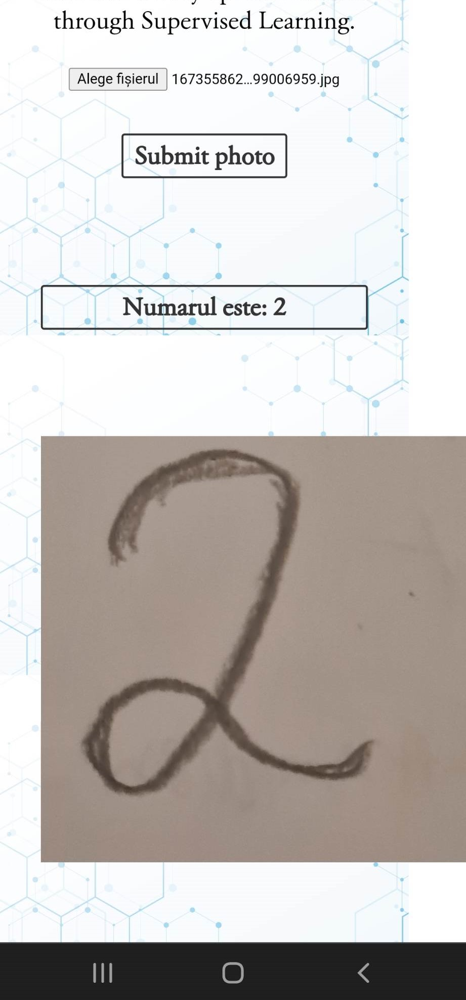
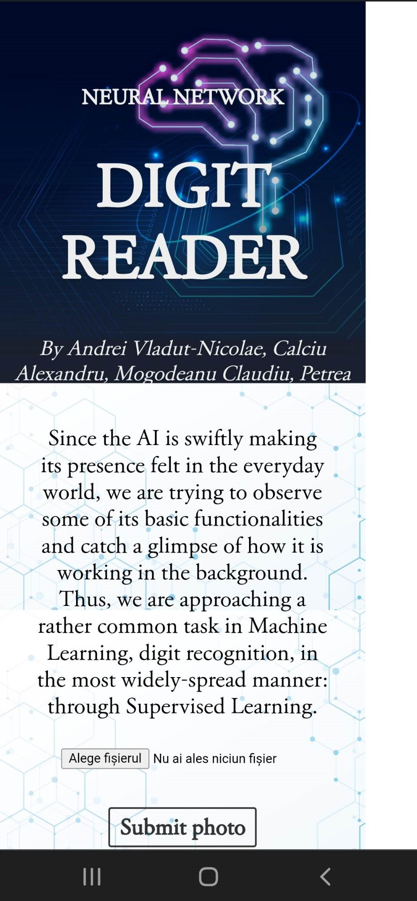

# Digit recogniser

An implementation of a digit recogniser using neural networks written in Python. Users are able to send a photo using a web interface in a browser and receive the digit displayed in the picture. It works both on mobile and desktop devices and there is an option to see a slideshow of all the photos sent in a session.
# Technologies used
- **Tensorflow** and **Keras** for training the neural network
- **Pillow**, **sci-kit image** and **OpenCV** for image processing
- **matplotlib** for testing and visualizing the data
- **numpy** for advanced mathematical operations
- **Flask** for implementing the backend
- **HTML**, **CSS** and **JavaScript** for the frontend of the app
# How to run

You can either use the Makefile by typing in the following command:
`$ make`

Or alternatively you can install the prerequisites manually and afterwards start the server:
```
$ pip install -r requirements.txt
$ python server.py
```

The server will start at port 5000 and you can interact with the application via the browser at `http://localhost:5000`.

For mobile phone usage you need to utilise your local IP address and have your firewall allow connections on that port.

There are differences in the camera support for desktop and mobile. To send a photo on a mobile device you can use the `Browse...` button and then submitting the photo, while on desktop the `Take photo` button does the submitting automatically.

# Samples
The `/samples` folder contains sample images which can be used for testing.
# Screenshots
- 
- 
- 
- 
# Contributions:

- Vlăduț-Nicolae Andrei ([Vladutaki](https://github.com/Vladutaki)):
    - designed the webpage/ui
    - tested the functionality of the application
- Alexandru Calciu ([calex257](https://github.com/calex257)):
    - engineered the backend
    - helped with the implementation of the frontend
- Claudiu Mogodeanu ([claudiu-mogo](https://github.com/claudiu-mogo)):
    - implemented and trained the neural network
    - processed the photos given as input
- Andrei Petrea ([ReGeLePuMa](https://github.com/ReGeLePuMa)):
    - developed the frontend and added camera support
    - added the slideshow functionality

# Difficulties faced:

- linking the webpage user interface to the machine learning side
- processing the image so as to make it suitable for detection
- implementing the slideshow
- correctly receiving the data from the frontend
- removing the EXIF when receiving photos from a mobile camera
